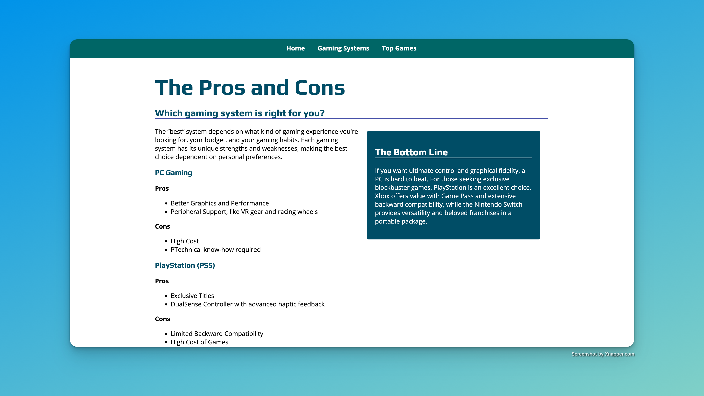

# joystickjunkies
# 🎮 Joystick Junkies Website

This project was one of my very first labs on functional HTML and CSS, built as part of my web development coursework at Saint Paul College.

## 📚 About

Joystick Junkies is a multi-page gaming website designed to practice:

- Semantic HTML structure
- CSS styling and layout
- Navigation with internal links
- Basic accessibility
- Incremental improvements to design and responsiveness over multiple labs

The project evolved across six lab submissions, improving visual design, code organization, and mobile responsiveness along the way.

## 💻 Features

- Home, Gaming Systems, and Top Games pages
- Responsive layout using CSS
- Custom colors, fonts, and images
- Navigation bar and footer
- Evolving design through Labs 2–6

## 🚀 Skills Practiced

- HTML5 best practices
- CSS selectors, box model, and typography
- Page layout and structure
- Accessibility considerations
- Design iteration and refinement

## 📸 Screenshots

### Home Page

### Gaming Systems Page

### Top Games Page

## 📂 Project Structure

